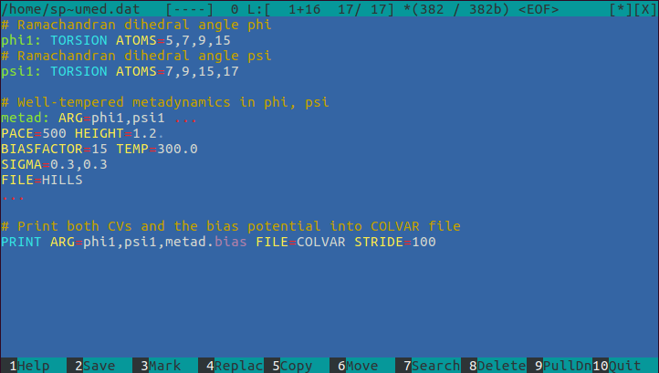

# mc_syntax_for_Plumed
Syntax highlight of plumed.dat files in Midnight Commander



# Instalation
Copy (as a root) `syntax/dat.syntax` to `/usr/share/mc/syntax/` and add lines:
```
file ..\*\\.(dat)$ Plumed\sCommands
include dat.syntax
```
to `/usr/share/mc/syntax/Syntax` above lines
```
file .\* unknown
include unknown.syntax
```

Alternatively (if you don't have root access) copy `syntax/dat.syntax` to `~/.local/share/mc/` or `~/.config/mc/mcedit` and add lines:
```
file ..\*\\.(dat)$ Plumed\sCommands
include /home/your_login/.local/share/mc/dat.syntax
```
or
```
file ..\*\\.(dat)$ Plumed\sCommands
include /home/your_login/.config/mc/mcedit/dat.syntax
```
to `~/.local/share/mc/Syntax` or `~/.config/mc/mcedit/Syntax` above lines
```
file .\* unknown
include unknown.syntax
```
